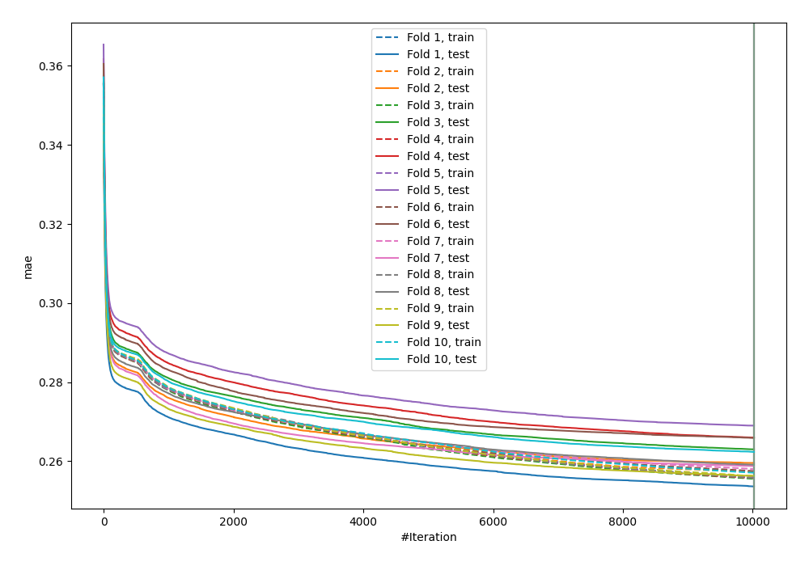
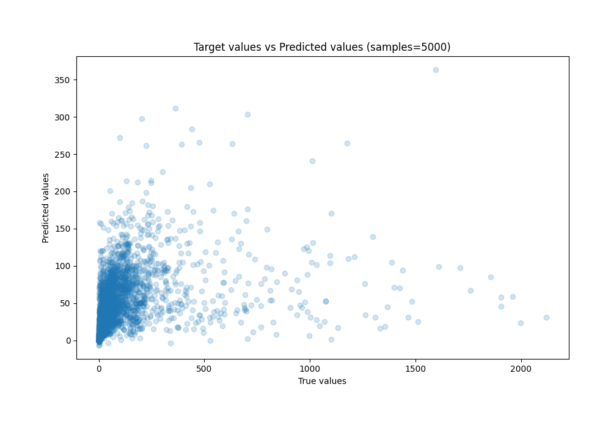
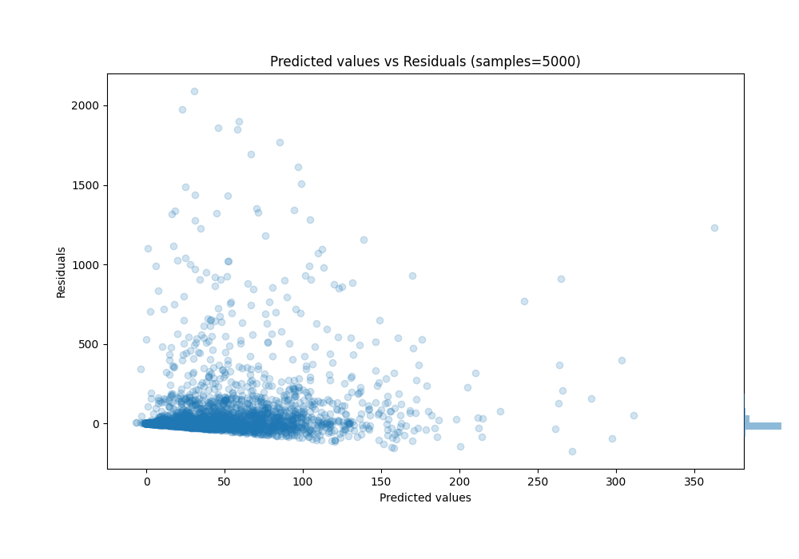

# Summary of 31_CatBoost

[<< Go back](../README.md)

## CatBoost
- **n_jobs**: -1
- **learning_rate**: 0.025
- **depth**: 6
- **rsm**: 1.0
- **loss_function**: MAPE
- **eval_metric**: MAE
- **explain_level**: 0

## Validation
 - **validation_type**: kfold
 - **k_folds**: 10
 - **shuffle**: True

## Optimized metric
mae

## Training time

3132.9 seconds

### Metric details:
| Metric   |           Score |
|:---------|----------------:|
| MAE      |    44.643       |
| MSE      | 25343.5         |
| RMSE     |   159.196       |
| R2       |     0.131353    |
| MAPE     |     3.56595e+11 |

## Learning curves

## True vs Predicted

## Predicted vs Residuals

[<< Go back](../README.md)
