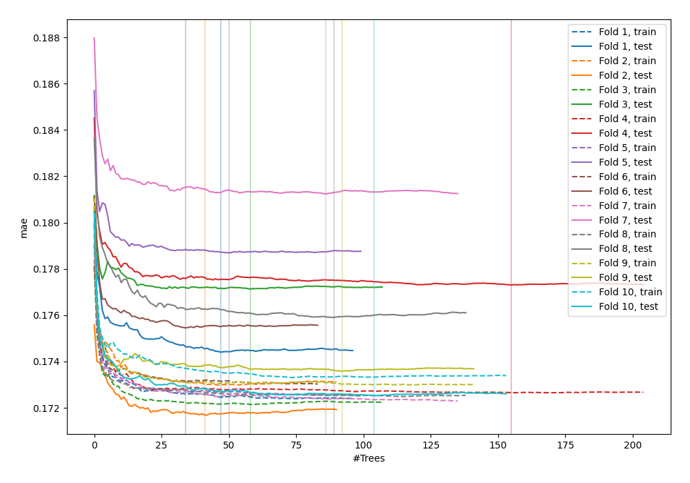
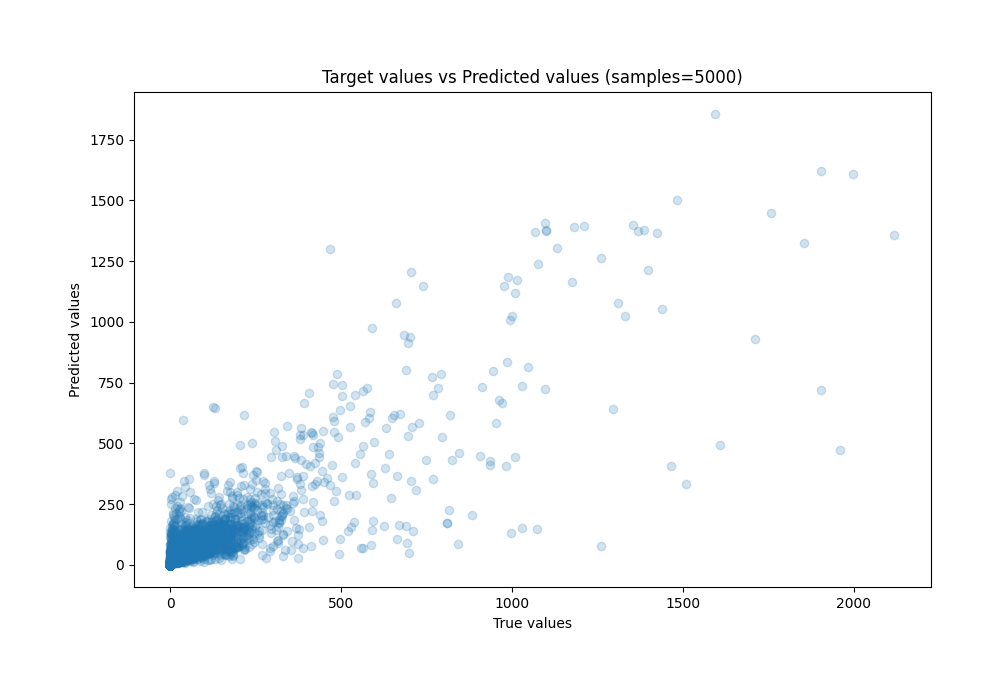
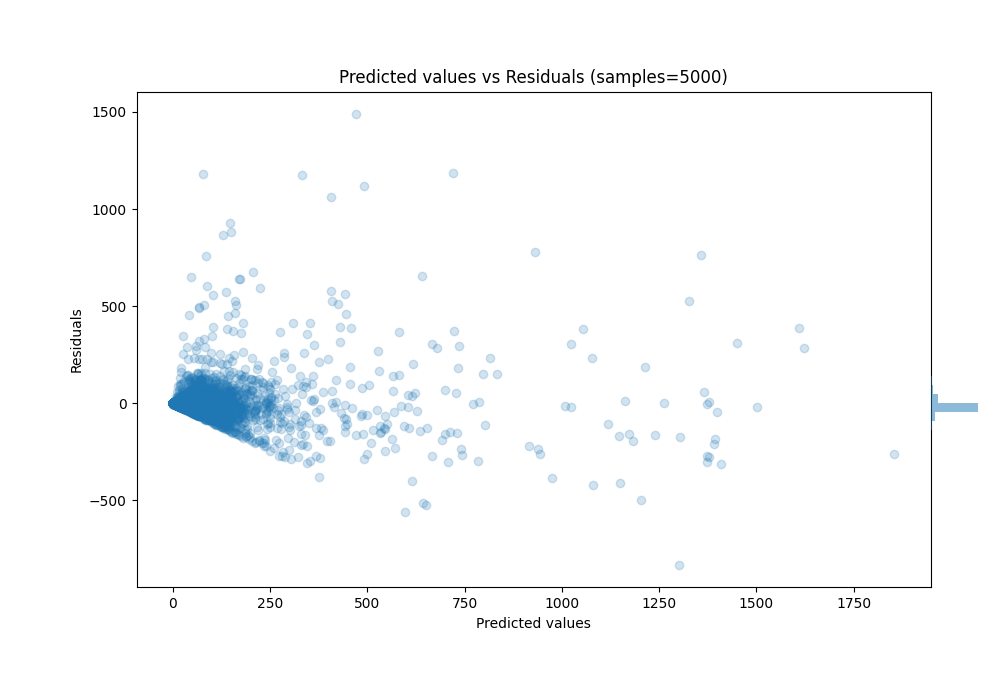

# Summary of 55_RandomForest_Stacked

[<< Go back](../README.md)

## Random Forest
- **n_jobs**: -1
- **criterion**: squared_error
- **max_features**: 0.8
- **min_samples_split**: 50
- **max_depth**: 6
- **eval_metric_name**: mae
- **explain_level**: 0

## Validation
 - **validation_type**: kfold
 - **k_folds**: 10
 - **shuffle**: True

## Optimized metric
mae

## Training time

737.0 seconds

### Metric details:
| Metric   |          Score |
|:---------|---------------:|
| MAE      |   30.0267      |
| MSE      | 7474.12        |
| RMSE     |   86.453       |
| R2       |    0.743825    |
| MAPE     |    3.74551e+14 |

## Learning curves

## True vs Predicted

## Predicted vs Residuals

[<< Go back](../README.md)
