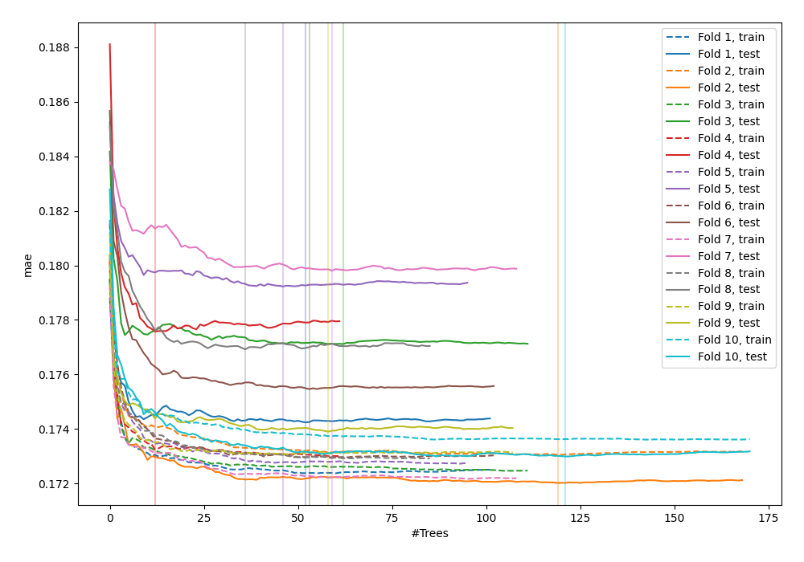
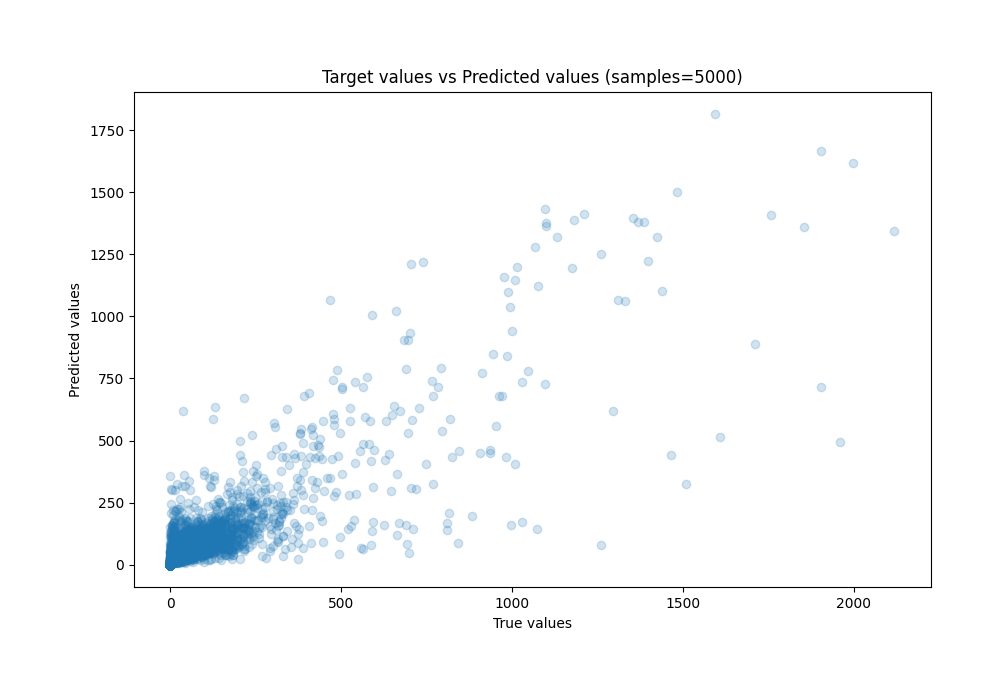
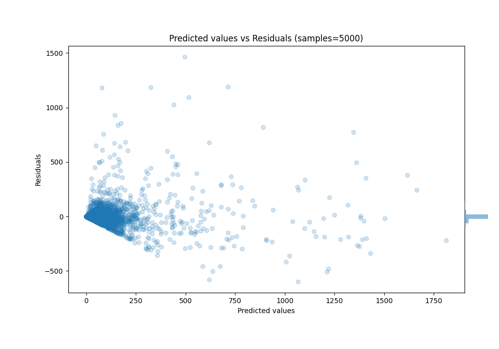

# Summary of 57_RandomForest_Stacked

[<< Go back](../README.md)

## Random Forest
- **n_jobs**: -1
- **criterion**: squared_error
- **max_features**: 0.5
- **min_samples_split**: 40
- **max_depth**: 6
- **eval_metric_name**: mae
- **explain_level**: 0

## Validation
 - **validation_type**: kfold
 - **k_folds**: 10
 - **shuffle**: True

## Optimized metric
mae

## Training time

482.7 seconds

### Metric details:
| Metric   |          Score |
|:---------|---------------:|
| MAE      |   30.0495      |
| MSE      | 7462.87        |
| RMSE     |   86.3879      |
| R2       |    0.744211    |
| MAPE     |    4.30975e+14 |

## Learning curves

## True vs Predicted

## Predicted vs Residuals

[<< Go back](../README.md)
