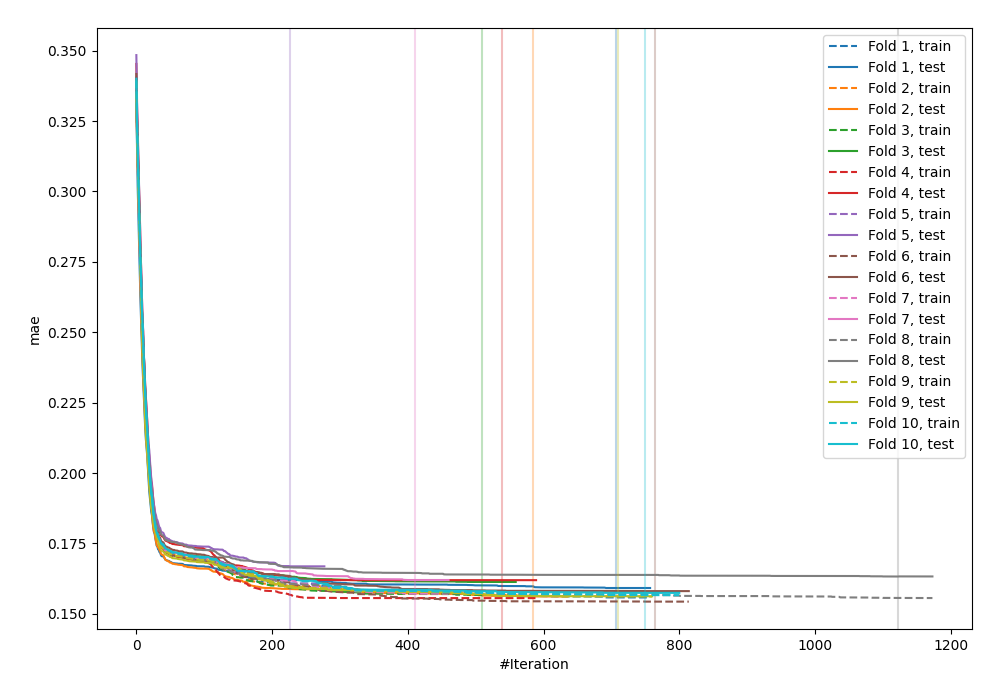
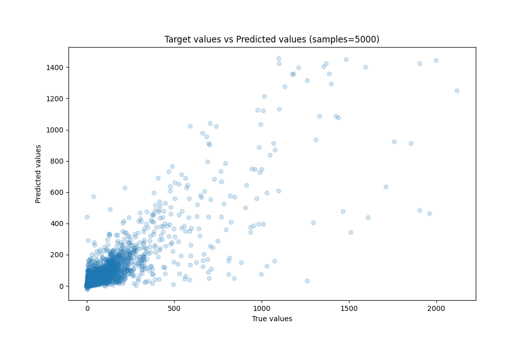
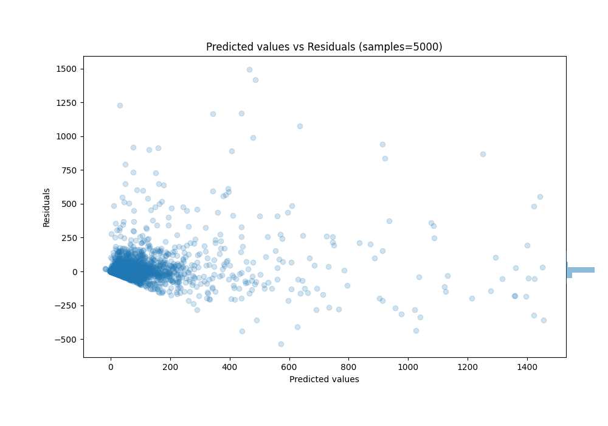

# Summary of 63_CatBoost_Stacked

[<< Go back](../README.md)

## CatBoost
- **n_jobs**: -1
- **learning_rate**: 0.1
- **depth**: 7
- **rsm**: 0.9
- **loss_function**: MAE
- **eval_metric**: MAE
- **explain_level**: 0

## Validation
 - **validation_type**: kfold
 - **k_folds**: 10
 - **shuffle**: True

## Optimized metric
mae

## Training time

346.3 seconds

### Metric details:
| Metric   |          Score |
|:---------|---------------:|
| MAE      |   27.3698      |
| MSE      | 7835.69        |
| RMSE     |   88.5195      |
| R2       |    0.731432    |
| MAPE     |    6.26223e+13 |

## Learning curves

## True vs Predicted

## Predicted vs Residuals

[<< Go back](../README.md)
