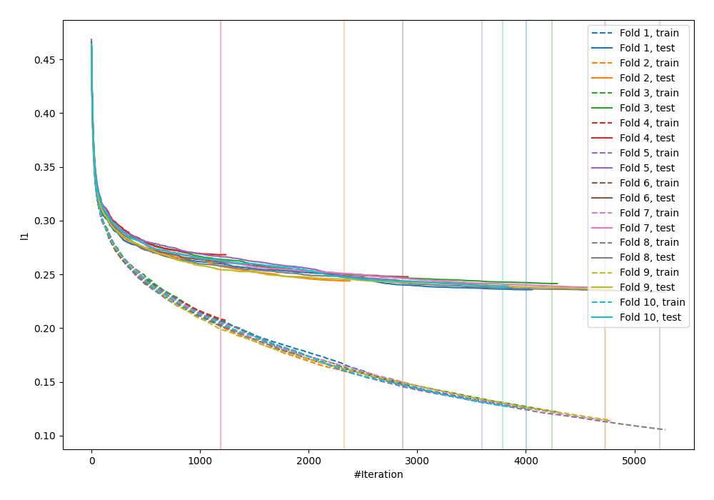
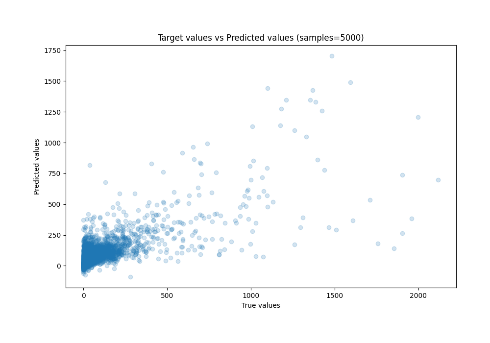
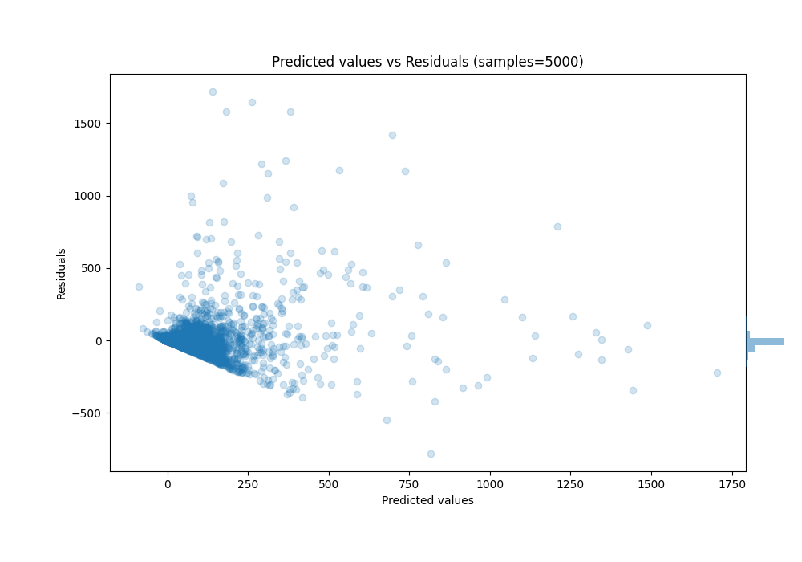

# Summary of 65_LightGBM

[<< Go back](../README.md)

## LightGBM
- **n_jobs**: -1
- **objective**: regression
- **num_leaves**: 95
- **learning_rate**: 0.05
- **feature_fraction**: 1.0
- **bagging_fraction**: 0.5
- **min_data_in_leaf**: 15
- **metric**: l1
- **custom_eval_metric_name**: None
- **explain_level**: 0

## Validation
 - **validation_type**: kfold
 - **k_folds**: 10
 - **shuffle**: True

## Optimized metric
mae

## Training time

362.9 seconds

### Metric details:
| Metric   |           Score |
|:---------|----------------:|
| MAE      |    41.4179      |
| MSE      | 11703.6         |
| RMSE     |   108.183       |
| R2       |     0.598858    |
| MAPE     |     7.10183e+15 |

## Learning curves

## True vs Predicted

## Predicted vs Residuals

[<< Go back](../README.md)
