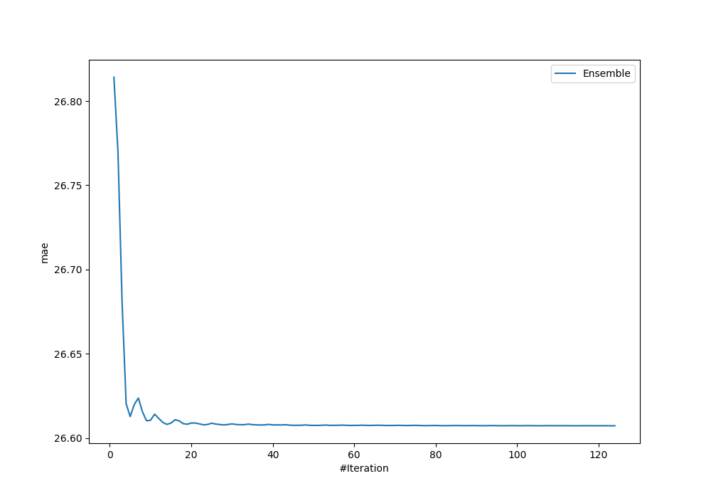
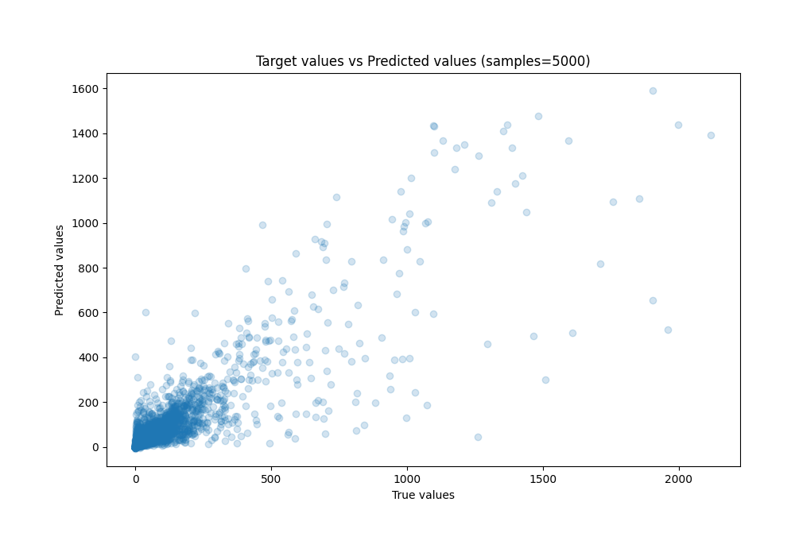
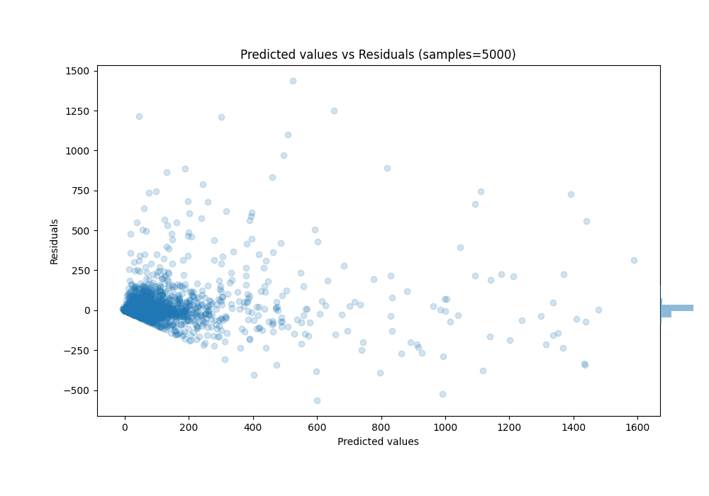

# Summary of Ensemble_Stacked

[<< Go back](../README.md)

## Ensemble structure
| Model                              |   Weight |
|:-----------------------------------|---------:|
| 17_LightGBM_Stacked                |        1 |
| 30_CatBoost_GoldenFeatures_Stacked |        1 |
| 49_LightGBM_Stacked                |        2 |
| 60_CatBoost_Stacked                |       26 |
| 61_CatBoost_Stacked                |       71 |
| 65_LightGBM_Stacked                |        2 |
| 67_LightGBM_Stacked                |        5 |
| 7_Xgboost_Stacked                  |       16 |

### Metric details:
| Metric   |          Score |
|:---------|---------------:|
| MAE      |   26.6073      |
| MSE      | 7232.68        |
| RMSE     |   85.0452      |
| R2       |    0.7521      |
| MAPE     |    2.10398e+14 |

## Learning curves

## True vs Predicted

## Predicted vs Residuals

[<< Go back](../README.md)
