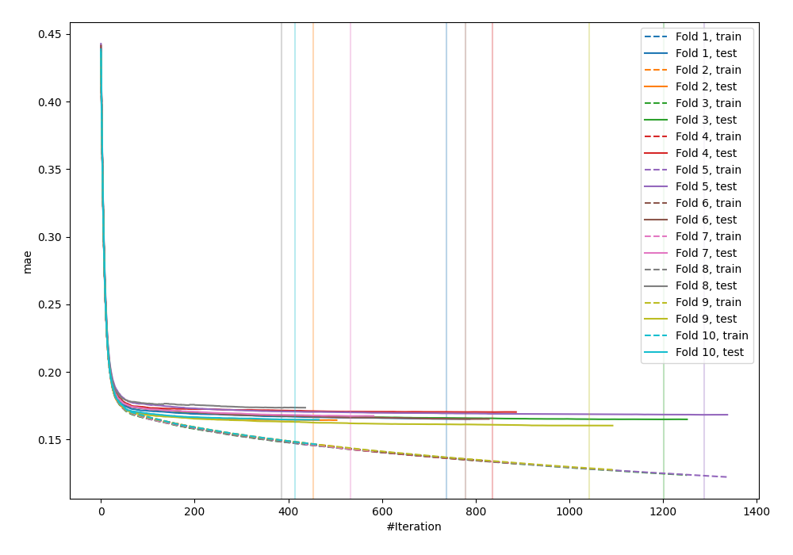
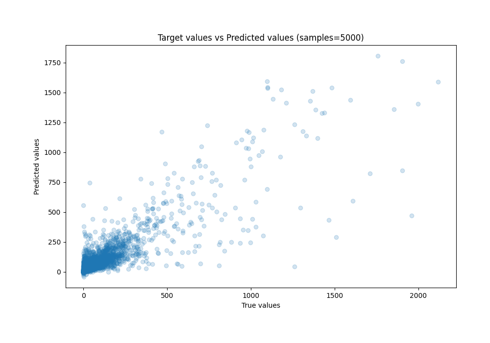
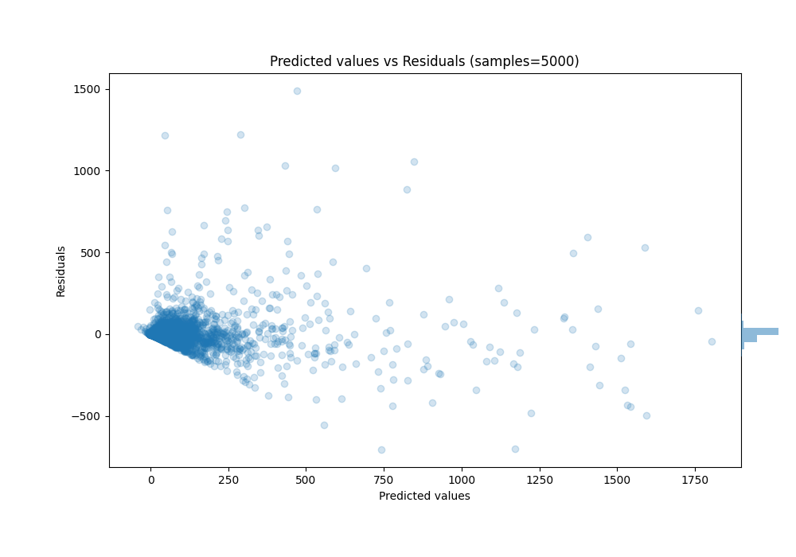

# Summary of 30_CatBoost_GoldenFeatures_Stacked

[<< Go back](../README.md)

## CatBoost
- **n_jobs**: -1
- **learning_rate**: 0.1
- **depth**: 8
- **rsm**: 1.0
- **loss_function**: RMSE
- **eval_metric**: MAE
- **explain_level**: 0

## Validation
 - **validation_type**: kfold
 - **k_folds**: 10
 - **shuffle**: True

## Optimized metric
mae

## Training time

203.0 seconds

### Metric details:
| Metric   |          Score |
|:---------|---------------:|
| MAE      |   28.4288      |
| MSE      | 6820.76        |
| RMSE     |   82.5879      |
| R2       |    0.766219    |
| MAPE     |    1.61475e+15 |

## Learning curves

## True vs Predicted

## Predicted vs Residuals

[<< Go back](../README.md)
