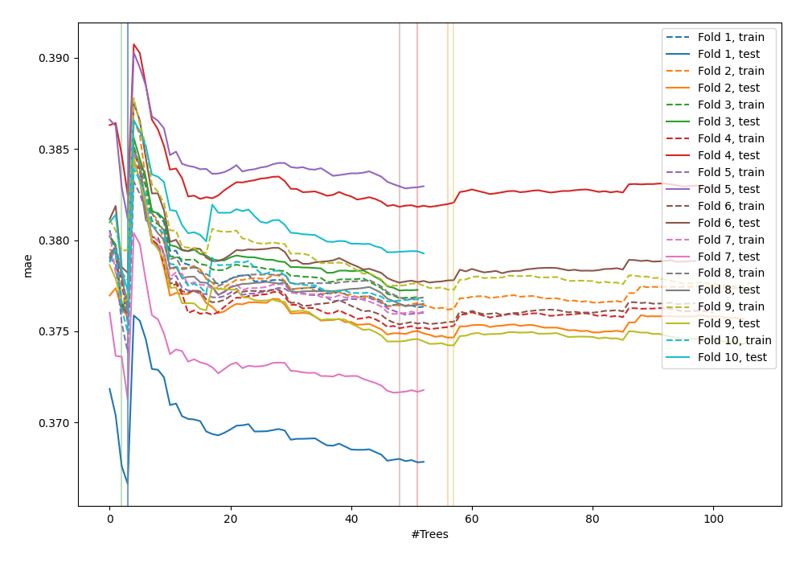
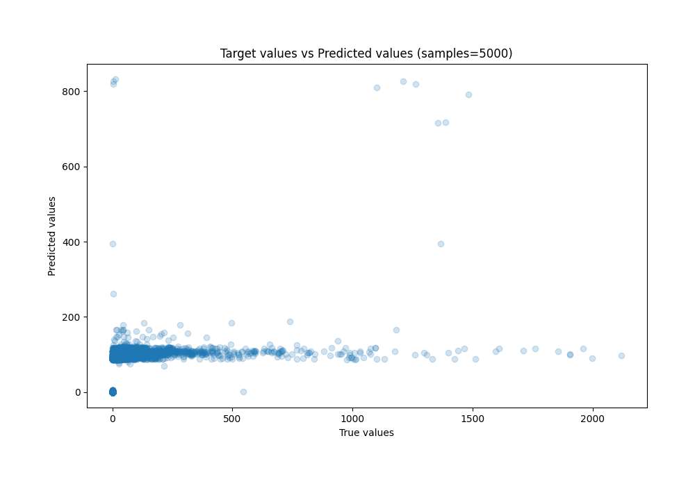
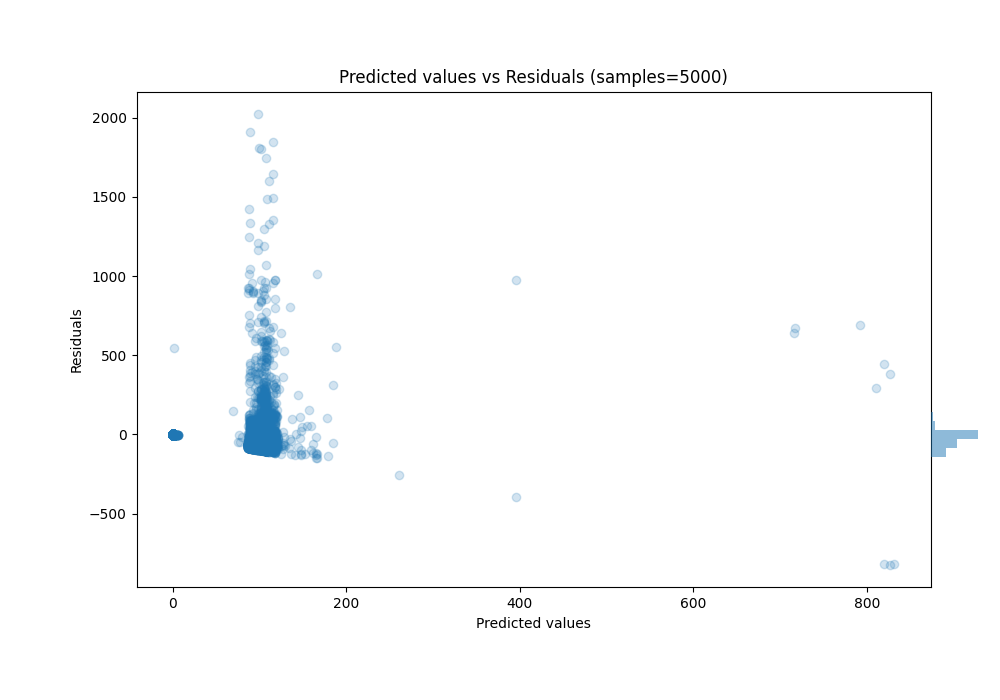

# Summary of 34_RandomForest

[<< Go back](../README.md)

## Random Forest
- **n_jobs**: -1
- **criterion**: squared_error
- **max_features**: 0.7
- **min_samples_split**: 30
- **max_depth**: 3
- **eval_metric_name**: mae
- **explain_level**: 0

## Validation
 - **validation_type**: kfold
 - **k_folds**: 10
 - **shuffle**: True

## Optimized metric
mae

## Training time

108.1 seconds

### Metric details:
| Metric   |           Score |
|:---------|----------------:|
| MAE      |    64.1682      |
| MSE      | 25430.9         |
| RMSE     |   159.471       |
| R2       |     0.128356    |
| MAPE     |     7.97663e+14 |

## Learning curves

## True vs Predicted

## Predicted vs Residuals

[<< Go back](../README.md)
