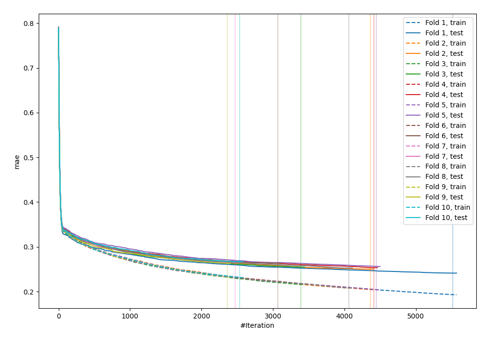
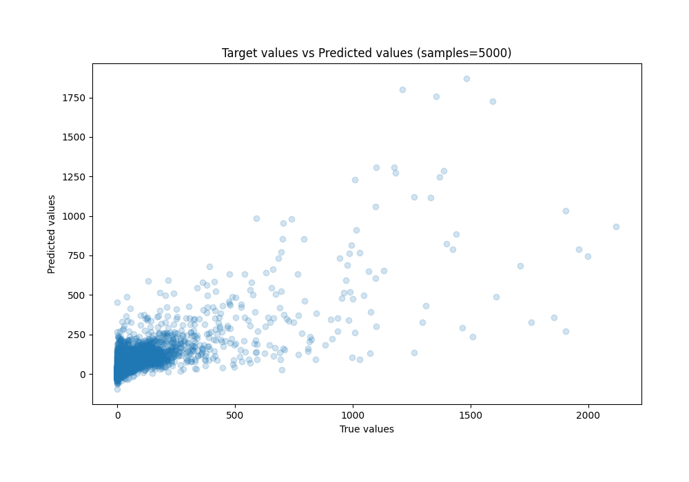
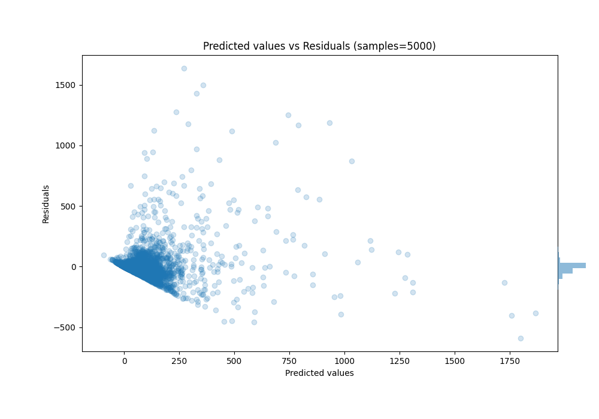

# Summary of 46_Xgboost

[<< Go back](../README.md)

## Extreme Gradient Boosting (Xgboost)
- **n_jobs**: -1
- **objective**: reg:squarederror
- **eta**: 0.075
- **max_depth**: 5
- **min_child_weight**: 1
- **subsample**: 1.0
- **colsample_bytree**: 1.0
- **eval_metric**: mae
- **explain_level**: 0

## Validation
 - **validation_type**: kfold
 - **k_folds**: 10
 - **shuffle**: True

## Optimized metric
mae

## Training time

1888.5 seconds

### Metric details:
| Metric   |           Score |
|:---------|----------------:|
| MAE      |    43.8293      |
| MSE      | 11474.5         |
| RMSE     |   107.119       |
| R2       |     0.606711    |
| MAPE     |     1.64734e+16 |

## Learning curves

## True vs Predicted

## Predicted vs Residuals

[<< Go back](../README.md)
