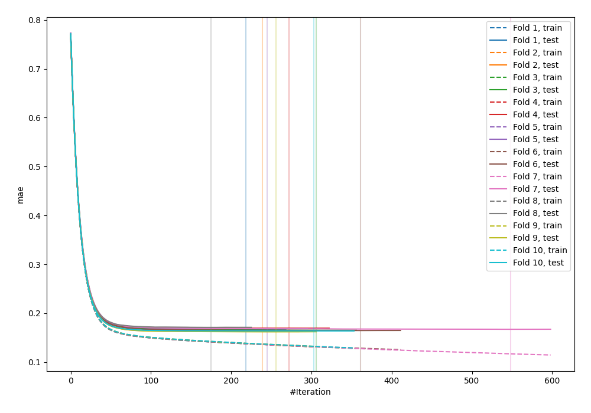
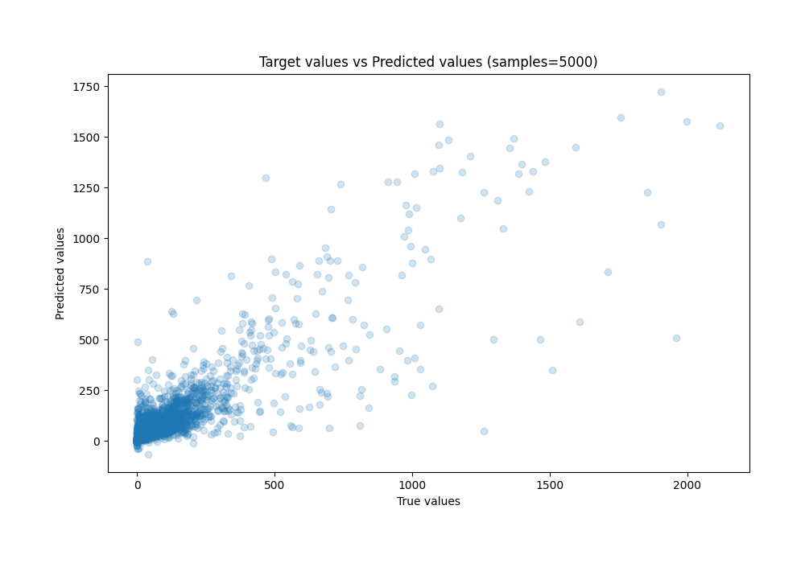
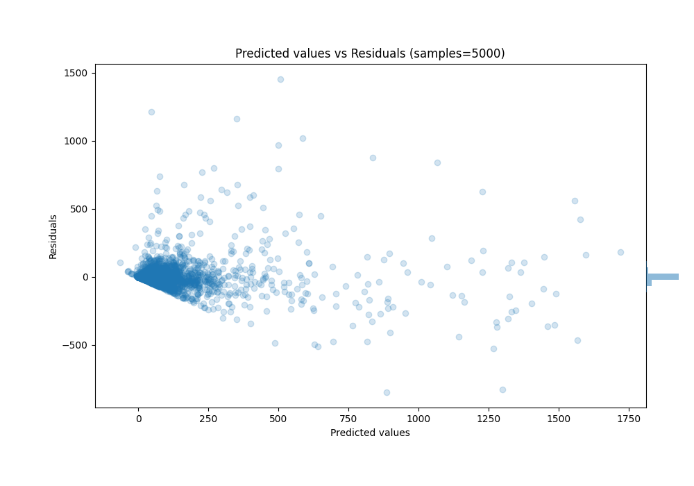

# Summary of 47_Xgboost_Stacked

[<< Go back](../README.md)

## Extreme Gradient Boosting (Xgboost)
- **n_jobs**: -1
- **objective**: reg:squarederror
- **eta**: 0.075
- **max_depth**: 7
- **min_child_weight**: 1
- **subsample**: 1.0
- **colsample_bytree**: 1.0
- **eval_metric**: mae
- **explain_level**: 0

## Validation
 - **validation_type**: kfold
 - **k_folds**: 10
 - **shuffle**: True

## Optimized metric
mae

## Training time

263.2 seconds

### Metric details:
| Metric   |          Score |
|:---------|---------------:|
| MAE      |   28.3543      |
| MSE      | 6892.3         |
| RMSE     |   83.0199      |
| R2       |    0.763767    |
| MAPE     |    1.12727e+15 |

## Learning curves

## True vs Predicted

## Predicted vs Residuals

[<< Go back](../README.md)
