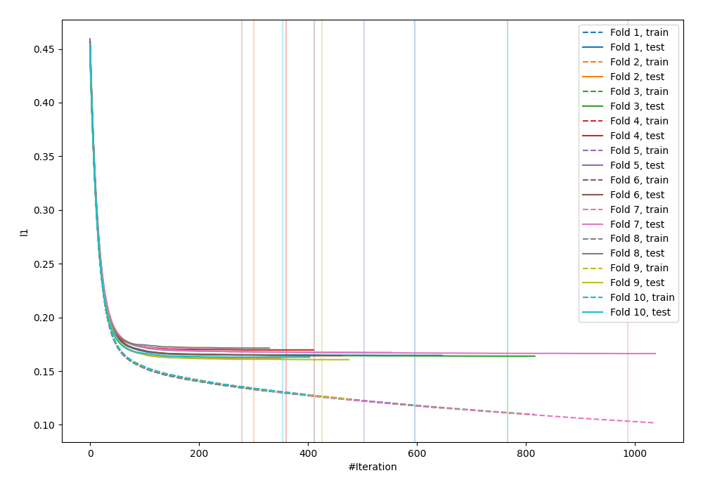
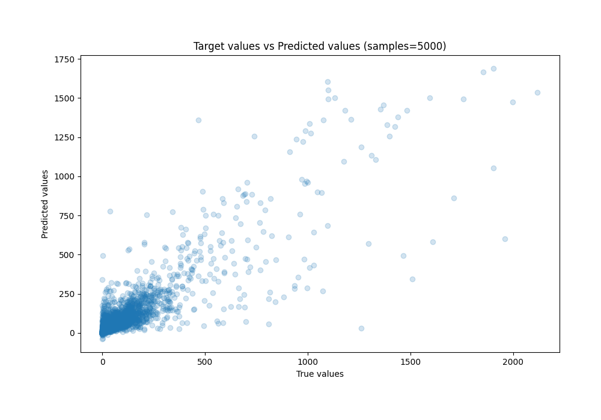
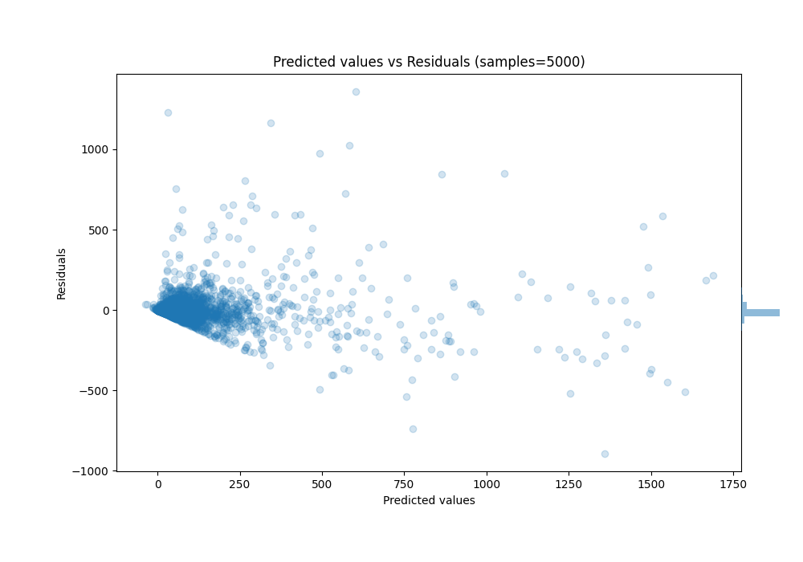

# Summary of 49_LightGBM_Stacked

[<< Go back](../README.md)

## LightGBM
- **n_jobs**: -1
- **objective**: regression
- **num_leaves**: 95
- **learning_rate**: 0.05
- **feature_fraction**: 1.0
- **bagging_fraction**: 0.5
- **min_data_in_leaf**: 10
- **metric**: l1
- **custom_eval_metric_name**: None
- **explain_level**: 0

## Validation
 - **validation_type**: kfold
 - **k_folds**: 10
 - **shuffle**: True

## Optimized metric
mae

## Training time

121.2 seconds

### Metric details:
| Metric   |          Score |
|:---------|---------------:|
| MAE      |   28.231       |
| MSE      | 6842.16        |
| RMSE     |   82.7174      |
| R2       |    0.765485    |
| MAPE     |    9.88873e+14 |

## Learning curves

## True vs Predicted

## Predicted vs Residuals

[<< Go back](../README.md)
