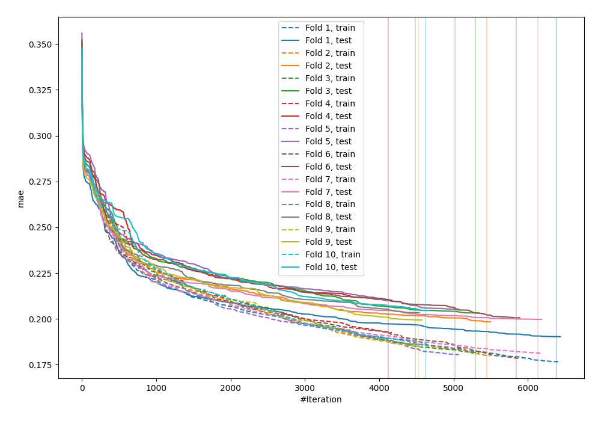
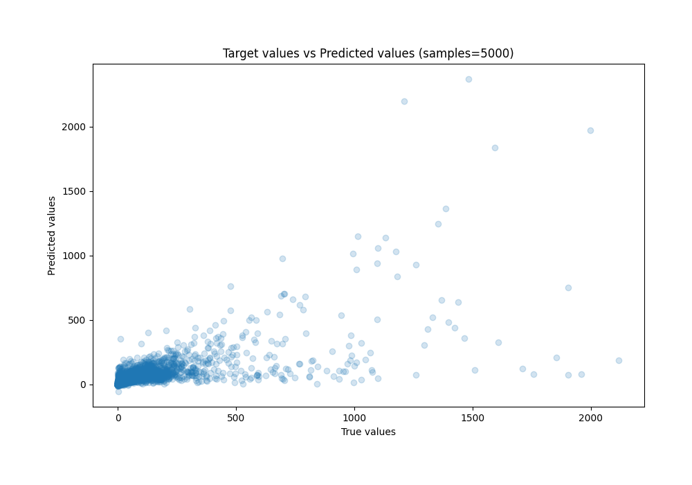
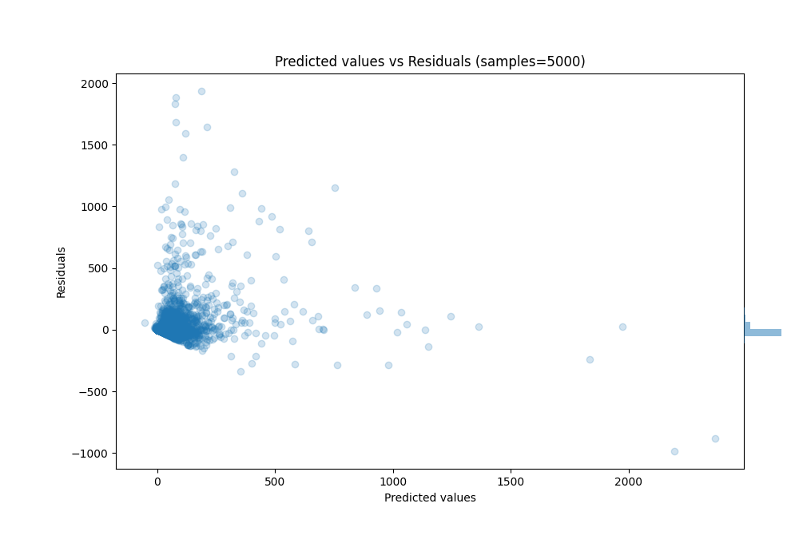

# Summary of 61_CatBoost

[<< Go back](../README.md)

## CatBoost
- **n_jobs**: -1
- **learning_rate**: 0.1
- **depth**: 8
- **rsm**: 0.9
- **loss_function**: MAE
- **eval_metric**: MAE
- **explain_level**: 0

## Validation
 - **validation_type**: kfold
 - **k_folds**: 10
 - **shuffle**: True

## Optimized metric
mae

## Training time

2093.9 seconds

### Metric details:
| Metric   |           Score |
|:---------|----------------:|
| MAE      |    34.4216      |
| MSE      | 14812.8         |
| RMSE     |   121.708       |
| R2       |     0.492292    |
| MAPE     |     9.70163e+13 |

## Learning curves

## True vs Predicted

## Predicted vs Residuals

[<< Go back](../README.md)
