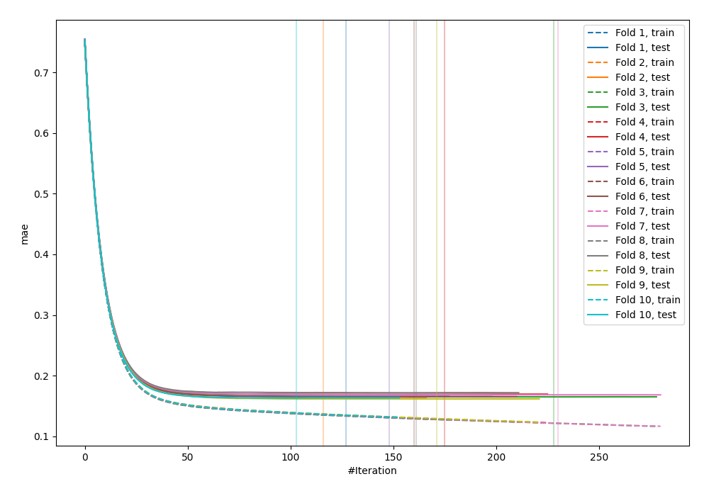
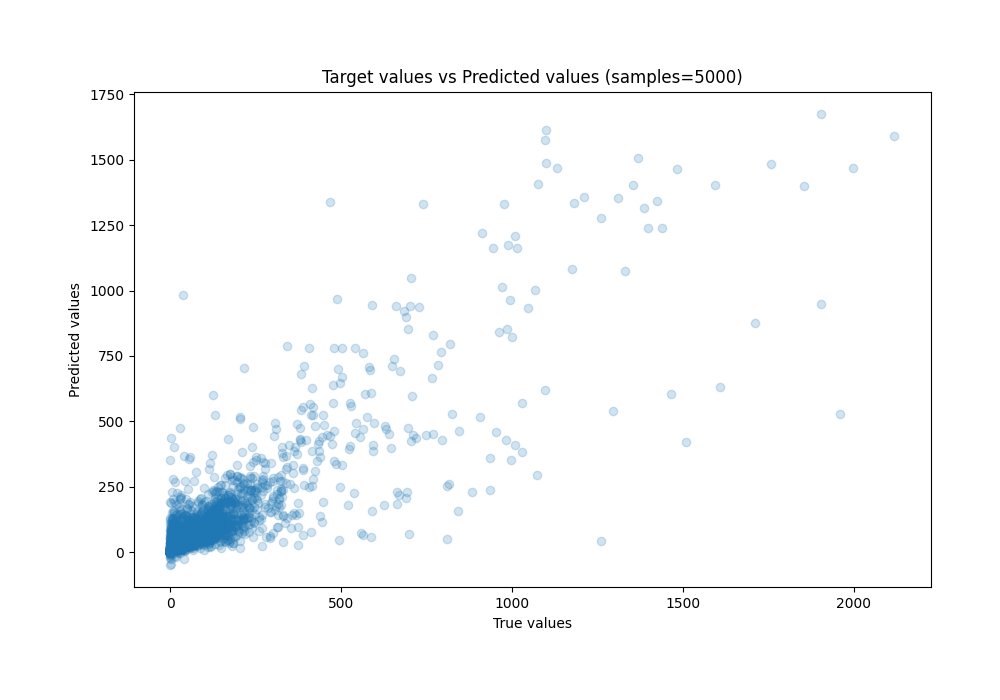
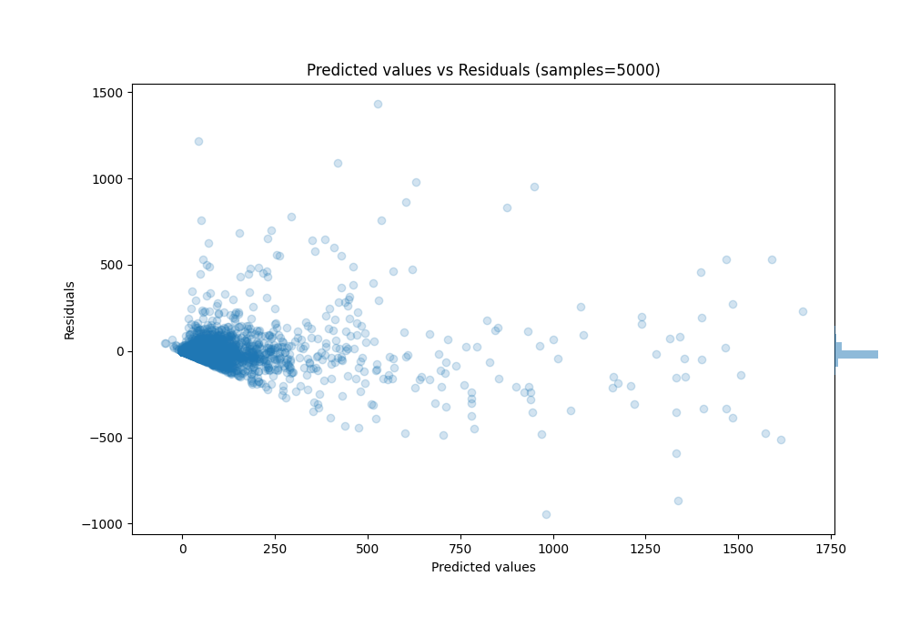

# Summary of 71_Xgboost_Stacked

[<< Go back](../README.md)

## Extreme Gradient Boosting (Xgboost)
- **n_jobs**: -1
- **objective**: reg:squarederror
- **eta**: 0.1
- **max_depth**: 8
- **min_child_weight**: 5
- **subsample**: 1.0
- **colsample_bytree**: 0.6
- **eval_metric**: mae
- **explain_level**: 0

## Validation
 - **validation_type**: kfold
 - **k_folds**: 10
 - **shuffle**: True

## Optimized metric
mae

## Training time

174.1 seconds

### Metric details:
| Metric   |          Score |
|:---------|---------------:|
| MAE      |   28.3252      |
| MSE      | 6898.86        |
| RMSE     |   83.0594      |
| R2       |    0.763542    |
| MAPE     |    9.51426e+14 |

## Learning curves

## True vs Predicted

## Predicted vs Residuals

[<< Go back](../README.md)
