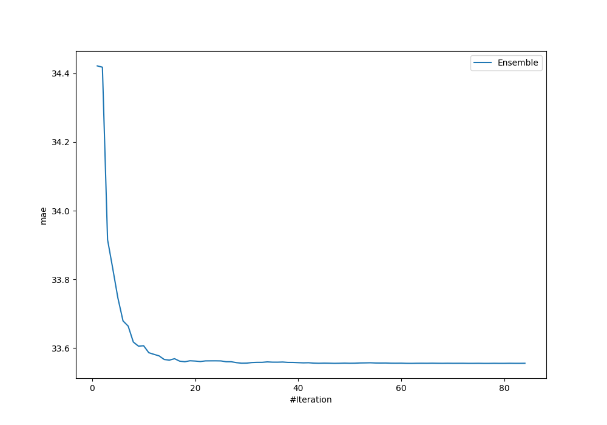
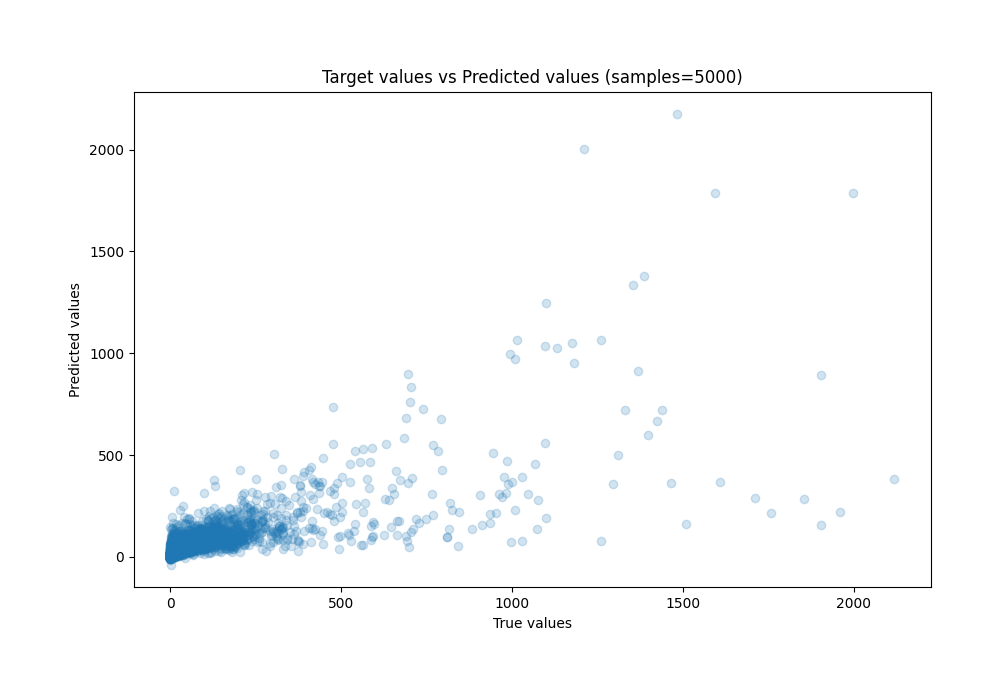
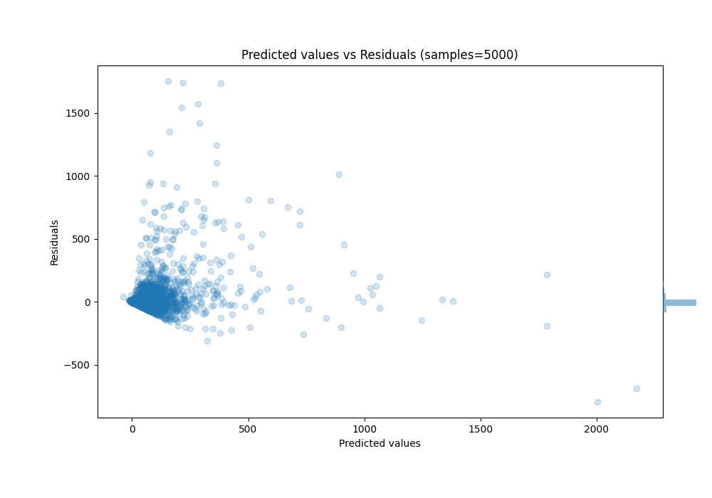

# Summary of Ensemble

[<< Go back](../README.md)

## Ensemble structure
| Model       |   Weight |
|:------------|---------:|
| 30_CatBoost |        5 |
| 47_Xgboost  |        3 |
| 61_CatBoost |       51 |
| 62_Xgboost  |        8 |
| 64_LightGBM |        5 |
| 66_LightGBM |        5 |

### Metric details:
| Metric   |           Score |
|:---------|----------------:|
| MAE      |    33.5556      |
| MSE      | 12055.3         |
| RMSE     |   109.797       |
| R2       |     0.586805    |
| MAPE     |     2.65486e+15 |

## Learning curves

## True vs Predicted

## Predicted vs Residuals

[<< Go back](../README.md)
