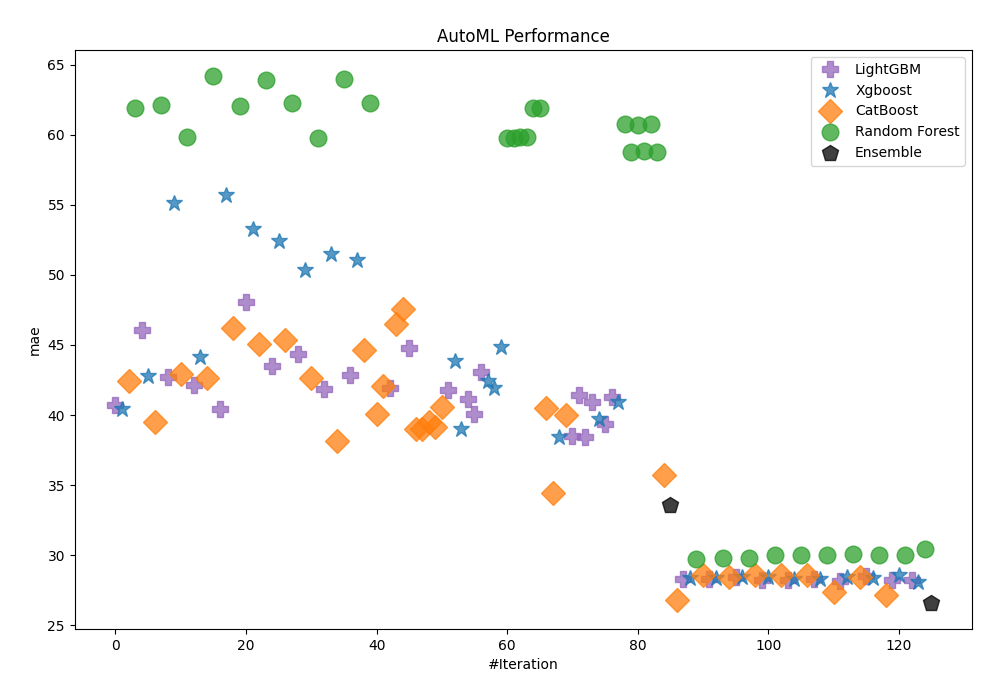
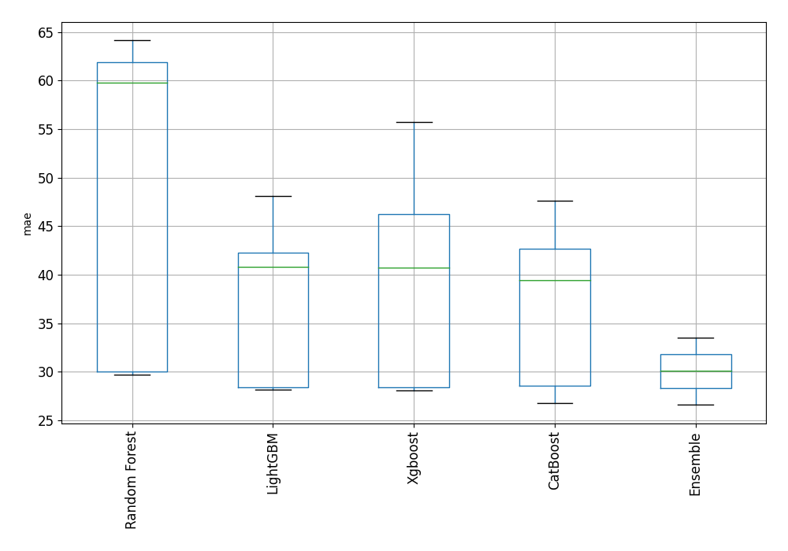
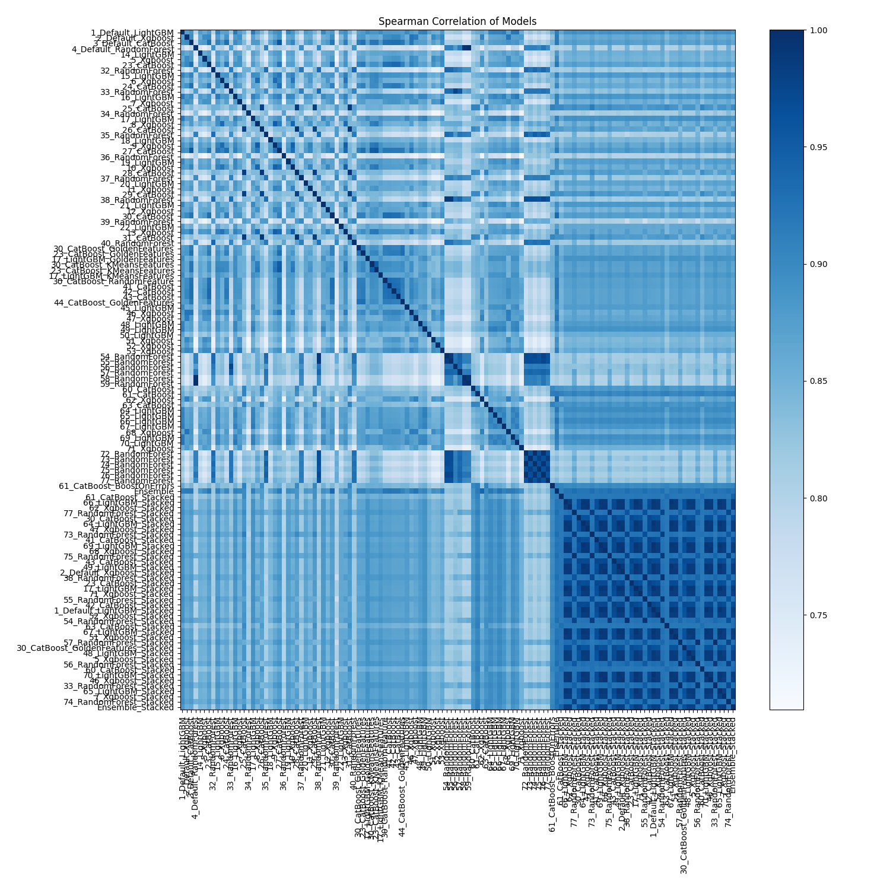

# AutoML Leaderboard

| Best model   | name                                                                               | model_type    | metric_type   |   metric_value |   train_time |
|:-------------|:-----------------------------------------------------------------------------------|:--------------|:--------------|---------------:|-------------:|
|              | [1_Default_LightGBM](1_Default_LightGBM/README.md)                                 | LightGBM      | mae           |        40.7474 |       450.4  |
|              | [2_Default_Xgboost](2_Default_Xgboost/README.md)                                   | Xgboost       | mae           |        40.4466 |       663.97 |
|              | [3_Default_CatBoost](3_Default_CatBoost/README.md)                                 | CatBoost      | mae           |        42.4326 |       408.78 |
|              | [4_Default_RandomForest](4_Default_RandomForest/README.md)                         | Random Forest | mae           |        61.9179 |       140.63 |
|              | [14_LightGBM](14_LightGBM/README.md)                                               | LightGBM      | mae           |        46.0628 |       180.19 |
|              | [5_Xgboost](5_Xgboost/README.md)                                                   | Xgboost       | mae           |        42.8039 |       423.07 |
|              | [23_CatBoost](23_CatBoost/README.md)                                               | CatBoost      | mae           |        39.4656 |      1566.22 |
|              | [32_RandomForest](32_RandomForest/README.md)                                       | Random Forest | mae           |        62.1563 |       184.01 |
|              | [15_LightGBM](15_LightGBM/README.md)                                               | LightGBM      | mae           |        42.6853 |       315.79 |
|              | [6_Xgboost](6_Xgboost/README.md)                                                   | Xgboost       | mae           |        55.1395 |        86.58 |
|              | [24_CatBoost](24_CatBoost/README.md)                                               | CatBoost      | mae           |        42.8957 |       575.17 |
|              | [33_RandomForest](33_RandomForest/README.md)                                       | Random Forest | mae           |        59.879  |       131.36 |
|              | [16_LightGBM](16_LightGBM/README.md)                                               | LightGBM      | mae           |        42.1578 |       400.12 |
|              | [7_Xgboost](7_Xgboost/README.md)                                                   | Xgboost       | mae           |        44.148  |       544.57 |
|              | [25_CatBoost](25_CatBoost/README.md)                                               | CatBoost      | mae           |        42.6372 |      3948.77 |
|              | [34_RandomForest](34_RandomForest/README.md)                                       | Random Forest | mae           |        64.1682 |       117.02 |
|              | [17_LightGBM](17_LightGBM/README.md)                                               | LightGBM      | mae           |        40.4381 |       430.46 |
|              | [8_Xgboost](8_Xgboost/README.md)                                                   | Xgboost       | mae           |        55.723  |       168.95 |
|              | [26_CatBoost](26_CatBoost/README.md)                                               | CatBoost      | mae           |        46.1893 |      2062.72 |
|              | [35_RandomForest](35_RandomForest/README.md)                                       | Random Forest | mae           |        62.036  |       140.45 |
|              | [18_LightGBM](18_LightGBM/README.md)                                               | LightGBM      | mae           |        48.0881 |        76.19 |
|              | [9_Xgboost](9_Xgboost/README.md)                                                   | Xgboost       | mae           |        53.3012 |       223.87 |
|              | [27_CatBoost](27_CatBoost/README.md)                                               | CatBoost      | mae           |        45.0756 |      1912.52 |
|              | [36_RandomForest](36_RandomForest/README.md)                                       | Random Forest | mae           |        63.9029 |        88.21 |
|              | [19_LightGBM](19_LightGBM/README.md)                                               | LightGBM      | mae           |        43.498  |       177.63 |
|              | [10_Xgboost](10_Xgboost/README.md)                                                 | Xgboost       | mae           |        52.4326 |       209.92 |
|              | [28_CatBoost](28_CatBoost/README.md)                                               | CatBoost      | mae           |        45.3794 |      1882.47 |
|              | [37_RandomForest](37_RandomForest/README.md)                                       | Random Forest | mae           |        62.2911 |       120.16 |
|              | [20_LightGBM](20_LightGBM/README.md)                                               | LightGBM      | mae           |        44.3665 |       112.19 |
|              | [11_Xgboost](11_Xgboost/README.md)                                                 | Xgboost       | mae           |        50.3568 |        97.93 |
|              | [29_CatBoost](29_CatBoost/README.md)                                               | CatBoost      | mae           |        42.6619 |       907.52 |
|              | [38_RandomForest](38_RandomForest/README.md)                                       | Random Forest | mae           |        59.7545 |       240.88 |
|              | [21_LightGBM](21_LightGBM/README.md)                                               | LightGBM      | mae           |        41.8557 |       176.39 |
|              | [12_Xgboost](12_Xgboost/README.md)                                                 | Xgboost       | mae           |        51.4685 |       129.68 |
|              | [30_CatBoost](30_CatBoost/README.md)                                               | CatBoost      | mae           |        38.1655 |       579.75 |
|              | [39_RandomForest](39_RandomForest/README.md)                                       | Random Forest | mae           |        63.9913 |       109.23 |
|              | [22_LightGBM](22_LightGBM/README.md)                                               | LightGBM      | mae           |        42.8457 |       109.91 |
|              | [13_Xgboost](13_Xgboost/README.md)                                                 | Xgboost       | mae           |        51.0463 |       356.83 |
|              | [31_CatBoost](31_CatBoost/README.md)                                               | CatBoost      | mae           |        44.643  |      3146.16 |
|              | [40_RandomForest](40_RandomForest/README.md)                                       | Random Forest | mae           |        62.2446 |       123.41 |
|              | [30_CatBoost_GoldenFeatures](30_CatBoost_GoldenFeatures/README.md)                 | CatBoost      | mae           |        40.1039 |       633.98 |
|              | [23_CatBoost_GoldenFeatures](23_CatBoost_GoldenFeatures/README.md)                 | CatBoost      | mae           |        42.0611 |      1145.94 |
|              | [17_LightGBM_GoldenFeatures](17_LightGBM_GoldenFeatures/README.md)                 | LightGBM      | mae           |        41.9362 |       386.81 |
|              | [30_CatBoost_KMeansFeatures](30_CatBoost_KMeansFeatures/README.md)                 | CatBoost      | mae           |        46.5317 |       361.77 |
|              | [23_CatBoost_KMeansFeatures](23_CatBoost_KMeansFeatures/README.md)                 | CatBoost      | mae           |        47.602  |       620.29 |
|              | [17_LightGBM_KMeansFeatures](17_LightGBM_KMeansFeatures/README.md)                 | LightGBM      | mae           |        44.7655 |       401.24 |
|              | [30_CatBoost_RandomFeature](30_CatBoost_RandomFeature/README.md)                   | CatBoost      | mae           |        39.0155 |       558.17 |
|              | [41_CatBoost](41_CatBoost/README.md)                                               | CatBoost      | mae           |        38.9698 |      1317.57 |
|              | [42_CatBoost](42_CatBoost/README.md)                                               | CatBoost      | mae           |        39.4893 |      1560.23 |
|              | [43_CatBoost](43_CatBoost/README.md)                                               | CatBoost      | mae           |        39.1547 |      1642.96 |
|              | [44_CatBoost_GoldenFeatures](44_CatBoost_GoldenFeatures/README.md)                 | CatBoost      | mae           |        40.5504 |      1303.72 |
|              | [45_LightGBM](45_LightGBM/README.md)                                               | LightGBM      | mae           |        41.7971 |       183.74 |
|              | [46_Xgboost](46_Xgboost/README.md)                                                 | Xgboost       | mae           |        43.8293 |      1897.59 |
|              | [47_Xgboost](47_Xgboost/README.md)                                                 | Xgboost       | mae           |        39.0017 |      1913.97 |
|              | [48_LightGBM](48_LightGBM/README.md)                                               | LightGBM      | mae           |        41.1777 |       231.42 |
|              | [49_LightGBM](49_LightGBM/README.md)                                               | LightGBM      | mae           |        40.0504 |       409.15 |
|              | [50_LightGBM](50_LightGBM/README.md)                                               | LightGBM      | mae           |        43.097  |        93.91 |
|              | [51_Xgboost](51_Xgboost/README.md)                                                 | Xgboost       | mae           |        42.3987 |      2480.2  |
|              | [52_Xgboost](52_Xgboost/README.md)                                                 | Xgboost       | mae           |        41.9051 |      1362.24 |
|              | [53_Xgboost](53_Xgboost/README.md)                                                 | Xgboost       | mae           |        44.8808 |      1595.18 |
|              | [54_RandomForest](54_RandomForest/README.md)                                       | Random Forest | mae           |        59.7666 |       230.69 |
|              | [55_RandomForest](55_RandomForest/README.md)                                       | Random Forest | mae           |        59.7643 |       209.26 |
|              | [56_RandomForest](56_RandomForest/README.md)                                       | Random Forest | mae           |        59.8583 |       123.86 |
|              | [57_RandomForest](57_RandomForest/README.md)                                       | Random Forest | mae           |        59.8159 |       129.44 |
|              | [58_RandomForest](58_RandomForest/README.md)                                       | Random Forest | mae           |        61.9212 |       137.73 |
|              | [59_RandomForest](59_RandomForest/README.md)                                       | Random Forest | mae           |        61.9352 |       143.29 |
|              | [60_CatBoost](60_CatBoost/README.md)                                               | CatBoost      | mae           |        40.4789 |       931.9  |
|              | [61_CatBoost](61_CatBoost/README.md)                                               | CatBoost      | mae           |        34.4216 |      2099.77 |
|              | [62_Xgboost](62_Xgboost/README.md)                                                 | Xgboost       | mae           |        38.4465 |      2295.3  |
|              | [63_CatBoost](63_CatBoost/README.md)                                               | CatBoost      | mae           |        40.0274 |      1491.3  |
|              | [64_LightGBM](64_LightGBM/README.md)                                               | LightGBM      | mae           |        38.4871 |       617.63 |
|              | [65_LightGBM](65_LightGBM/README.md)                                               | LightGBM      | mae           |        41.4179 |       372.12 |
|              | [66_LightGBM](66_LightGBM/README.md)                                               | LightGBM      | mae           |        38.4256 |       792.48 |
|              | [67_LightGBM](67_LightGBM/README.md)                                               | LightGBM      | mae           |        40.9508 |       420.46 |
|              | [68_Xgboost](68_Xgboost/README.md)                                                 | Xgboost       | mae           |        39.702  |      2692.62 |
|              | [69_LightGBM](69_LightGBM/README.md)                                               | LightGBM      | mae           |        39.3686 |       749.62 |
|              | [70_LightGBM](70_LightGBM/README.md)                                               | LightGBM      | mae           |        41.2623 |       463.79 |
|              | [71_Xgboost](71_Xgboost/README.md)                                                 | Xgboost       | mae           |        40.9601 |      1350    |
|              | [72_RandomForest](72_RandomForest/README.md)                                       | Random Forest | mae           |        60.747  |       175.6  |
|              | [73_RandomForest](73_RandomForest/README.md)                                       | Random Forest | mae           |        58.8069 |       232.57 |
|              | [74_RandomForest](74_RandomForest/README.md)                                       | Random Forest | mae           |        60.7211 |       183.48 |
|              | [75_RandomForest](75_RandomForest/README.md)                                       | Random Forest | mae           |        58.8298 |       230.01 |
|              | [76_RandomForest](76_RandomForest/README.md)                                       | Random Forest | mae           |        60.7474 |       203.04 |
|              | [77_RandomForest](77_RandomForest/README.md)                                       | Random Forest | mae           |        58.8061 |       234.42 |
|              | [61_CatBoost_BoostOnErrors](61_CatBoost_BoostOnErrors/README.md)                   | CatBoost      | mae           |        35.7338 |      1509.07 |
|              | [Ensemble](Ensemble/README.md)                                                     | Ensemble      | mae           |        33.5556 |        28.52 |
|              | [61_CatBoost_Stacked](61_CatBoost_Stacked/README.md)                               | CatBoost      | mae           |        26.8141 |       877.25 |
|              | [66_LightGBM_Stacked](66_LightGBM_Stacked/README.md)                               | LightGBM      | mae           |        28.2609 |       136.14 |
|              | [62_Xgboost_Stacked](62_Xgboost_Stacked/README.md)                                 | Xgboost       | mae           |        28.3616 |       240.93 |
|              | [77_RandomForest_Stacked](77_RandomForest_Stacked/README.md)                       | Random Forest | mae           |        29.7527 |      1026.34 |
|              | [30_CatBoost_Stacked](30_CatBoost_Stacked/README.md)                               | CatBoost      | mae           |        28.5606 |       190.5  |
|              | [64_LightGBM_Stacked](64_LightGBM_Stacked/README.md)                               | LightGBM      | mae           |        28.3264 |       126.9  |
|              | [47_Xgboost_Stacked](47_Xgboost_Stacked/README.md)                                 | Xgboost       | mae           |        28.3543 |       273.77 |
|              | [73_RandomForest_Stacked](73_RandomForest_Stacked/README.md)                       | Random Forest | mae           |        29.7603 |       951.2  |
|              | [41_CatBoost_Stacked](41_CatBoost_Stacked/README.md)                               | CatBoost      | mae           |        28.4546 |       361.82 |
|              | [69_LightGBM_Stacked](69_LightGBM_Stacked/README.md)                               | LightGBM      | mae           |        28.4245 |       130.46 |
|              | [68_Xgboost_Stacked](68_Xgboost_Stacked/README.md)                                 | Xgboost       | mae           |        28.4548 |       223.24 |
|              | [75_RandomForest_Stacked](75_RandomForest_Stacked/README.md)                       | Random Forest | mae           |        29.7689 |       930.21 |
|              | [43_CatBoost_Stacked](43_CatBoost_Stacked/README.md)                               | CatBoost      | mae           |        28.5555 |       254.52 |
|              | [49_LightGBM_Stacked](49_LightGBM_Stacked/README.md)                               | LightGBM      | mae           |        28.231  |       134.52 |
|              | [2_Default_Xgboost_Stacked](2_Default_Xgboost_Stacked/README.md)                   | Xgboost       | mae           |        28.4606 |       253.06 |
|              | [38_RandomForest_Stacked](38_RandomForest_Stacked/README.md)                       | Random Forest | mae           |        30.0254 |       734.32 |
|              | [23_CatBoost_Stacked](23_CatBoost_Stacked/README.md)                               | CatBoost      | mae           |        28.5752 |       253.25 |
|              | [17_LightGBM_Stacked](17_LightGBM_Stacked/README.md)                               | LightGBM      | mae           |        28.2173 |       125.57 |
|              | [71_Xgboost_Stacked](71_Xgboost_Stacked/README.md)                                 | Xgboost       | mae           |        28.3252 |       184.13 |
|              | [55_RandomForest_Stacked](55_RandomForest_Stacked/README.md)                       | Random Forest | mae           |        30.0267 |       744.73 |
|              | [42_CatBoost_Stacked](42_CatBoost_Stacked/README.md)                               | CatBoost      | mae           |        28.5934 |       227.79 |
|              | [1_Default_LightGBM_Stacked](1_Default_LightGBM_Stacked/README.md)                 | LightGBM      | mae           |        28.3043 |       169.43 |
|              | [52_Xgboost_Stacked](52_Xgboost_Stacked/README.md)                                 | Xgboost       | mae           |        28.3148 |       185.44 |
|              | [54_RandomForest_Stacked](54_RandomForest_Stacked/README.md)                       | Random Forest | mae           |        30.0218 |       701.92 |
|              | [63_CatBoost_Stacked](63_CatBoost_Stacked/README.md)                               | CatBoost      | mae           |        27.3698 |       353.01 |
|              | [67_LightGBM_Stacked](67_LightGBM_Stacked/README.md)                               | LightGBM      | mae           |        28.1714 |       127.86 |
|              | [51_Xgboost_Stacked](51_Xgboost_Stacked/README.md)                                 | Xgboost       | mae           |        28.4075 |       203.72 |
|              | [57_RandomForest_Stacked](57_RandomForest_Stacked/README.md)                       | Random Forest | mae           |        30.0495 |       495.85 |
|              | [30_CatBoost_GoldenFeatures_Stacked](30_CatBoost_GoldenFeatures_Stacked/README.md) | CatBoost      | mae           |        28.4288 |       210.41 |
|              | [48_LightGBM_Stacked](48_LightGBM_Stacked/README.md)                               | LightGBM      | mae           |        28.5224 |        68.94 |
|              | [5_Xgboost_Stacked](5_Xgboost_Stacked/README.md)                                   | Xgboost       | mae           |        28.3439 |       189.43 |
|              | [56_RandomForest_Stacked](56_RandomForest_Stacked/README.md)                       | Random Forest | mae           |        30.0399 |       466.1  |
|              | [60_CatBoost_Stacked](60_CatBoost_Stacked/README.md)                               | CatBoost      | mae           |        27.1208 |       425.62 |
|              | [70_LightGBM_Stacked](70_LightGBM_Stacked/README.md)                               | LightGBM      | mae           |        28.2452 |       144.61 |
|              | [46_Xgboost_Stacked](46_Xgboost_Stacked/README.md)                                 | Xgboost       | mae           |        28.5887 |       272.3  |
|              | [33_RandomForest_Stacked](33_RandomForest_Stacked/README.md)                       | Random Forest | mae           |        30.0426 |       477.78 |
|              | [65_LightGBM_Stacked](65_LightGBM_Stacked/README.md)                               | LightGBM      | mae           |        28.1937 |       128.42 |
|              | [7_Xgboost_Stacked](7_Xgboost_Stacked/README.md)                                   | Xgboost       | mae           |        28.0593 |       307.32 |
|              | [74_RandomForest_Stacked](74_RandomForest_Stacked/README.md)                       | Random Forest | mae           |        30.4249 |       552.11 |
| **the best** | [Ensemble_Stacked](Ensemble_Stacked/README.md)                                     | Ensemble      | mae           |        26.6073 |        52.59 |

### AutoML Performance

### AutoML Performance Boxplot

### Spearman Correlation of Models

